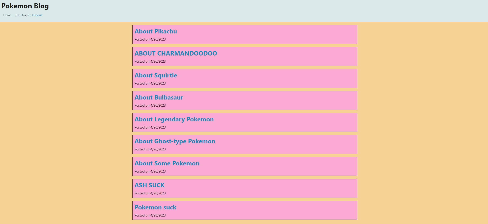
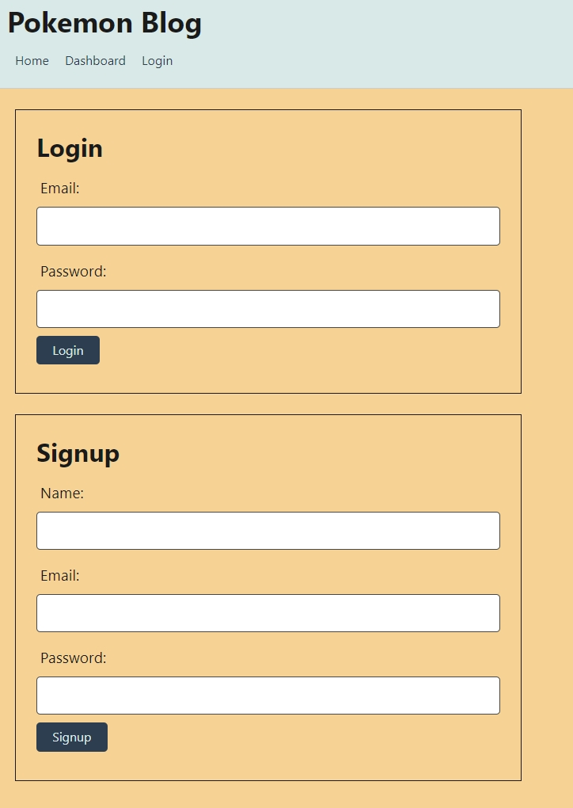
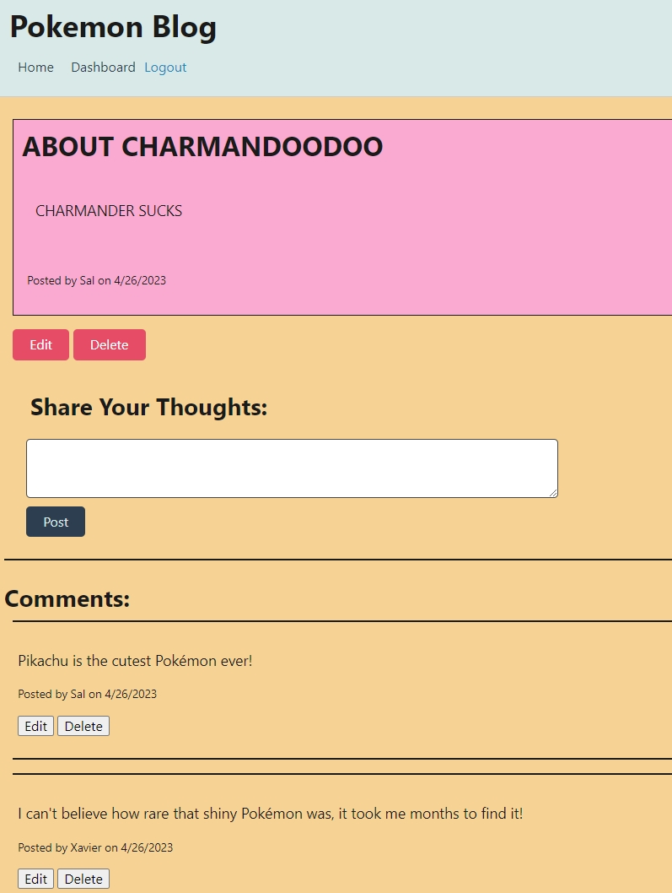

# Pokemon-Blog
A CMS-Style blog site where Pokemon enthusiasts can publish and comment on other Poke-Masters' posts as well, built with Node, Express, Sequelize, and Handlebars.

A link to the deployed site can be found [here](https://drive.google.com/file/d/11a1-Cj32JJUF0RVaaQaYw1MOuA8rxwIT/view)

## Screenshot

## Features

- Built with Node, Express, MySQL, and Sequelize
- User can view blog posts made by other users. 
- If the user create and account and log in, they can also make their own blog posts and comment on other people's posts.
- With a created account, other options are also available for a logged in user as well, such as the ability to see their post history, edit, and delete them.

## Table of Contents 

* [Installation](#installation)

* [Usage](#usage)

* [License](#license)

* [Contributing](#contributing)

* [Tests](#tests)

* [Questions](#questions)

## Installation

To install necessary dependencies, run the following command:
~~~
npm i
~~~

Insert mySQL database's name, user's name, password into the connection.js file directly or via dotenv

Run schema.sql

To seed the database, run the follow command:
~~~
npm run seed
~~~

## Usage

Perform a git clone and run the code with "npm start"

Recommended softwares: 
- MySQL Workbench to see database changes
- Insomnia to view back end routes

## License

MIT

## Contributing

Fork the repo and create pull requests

## Tests

To run tests, run the following command:
~~~
npm test
~~~
## Questions

If you have any questions about the repo, open an issue or contact me directly at Algarvian2001@yahoo.com. You can find more of my works at [NganPham89](https://github.com/NganPham89).
